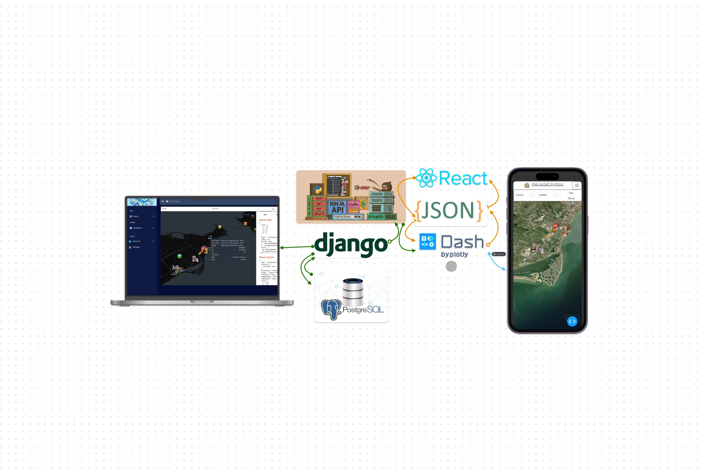

# Django-Dash-Token-Authentication


[](https://github.com/ambv/black)


[](https://community.plotly.com/t/django-dash-token-authentication/82088)



## Introduction

Django-Dash-Token-Authentication is a project that integrates Django's powerful backend capabilities with Dash's interactive data visualization frontend, focusing on secure token-based authentication on a Django Ninja API. This integration allows for the development of web applications that require user authentication to access and interact with Dash apps based on the Django's Database, User Model and Profile Models.py.

## Features

- **Secure Authentication**: Uses token-based authentication to securely manage user sessions.
- **Interactive Dashboards**: Leverage Dash to create interactive data visualizations that are protected behind authentication.
- **Django Backend**: Utilize Django's robust backend framework for handling user data, authentication flows, and more.

## Prerequisites

Before you begin, ensure you have met the following requirements:
- Python 3.7
- Postgres
- pip and virtualenv

## Installation

Follow these steps to get your development environment set up:

1. **Clone the repository**

    ```
    git clone https://github.com/yourusername/Django-Dash-Token-Authentication.git
    ```

2. **Create and activate a virtual environment**

    - **Windows:**

        ```
        python -m venv venv
        venv\Scripts\activate
        ```

    - **macOS/Linux:**

        ```
        python3 -m venv venv
        source venv/bin/activate
        ```

3. **Install the required dependencies**

    ```
    pip install -r requirements.txt
    ```

## Configuration

- **Setting up Django:**

    Navigate to the Django project directory and run:

    ```
    python manage.py makemigrations
    python manage.py migrate
    python manage.py createsuperuser
    python manage.py runserver
    ```
  Navigate to `http://127.0.0.1:8000/admin` and create a profile to match your django account.


- **Integrating Dash Apps:**
  ```
  > Run app.py
  ```
    Ensure your Dash apps are placed outside the Django project structure and correctly configured to use Django's api from the folder data.
## Usage

After installation and configuration, you can run the Django development server to start using the Dash apps with token authentication:

Navigate to `http://127.0.0.1:8000/` to access the Django project and your Dash apps. 

`http://127.0.0.1:8000/api/docs` to check out the API documentation.

For the dash app url when running app.py: `http://127.0.0.1:8311/`

## Contributing

Contributions to the Django-Dash-Token-Authentication project are welcome!

1. Fork the repository.
2. Create a new branch (`git checkout -b feature/AmazingFeature`).
3. Commit your changes (`git commit -m 'Add some AmazingFeature'`).
4. Push to the branch (`git push origin feature/AmazingFeature`).
5. Open a pull request.

## License

Distributed under the MIT License. See `LICENSE` for more information.

## Contact

Pip-Install-Python - [@PipInstallPython](https://www.youtube.com/@pipinstallpython)

Project Link: [https://github.com/pip-install-python/Django-Dash-Token-Authentication](https://github.com/pip-install-python/Django-Dash-Token-Authentication)
